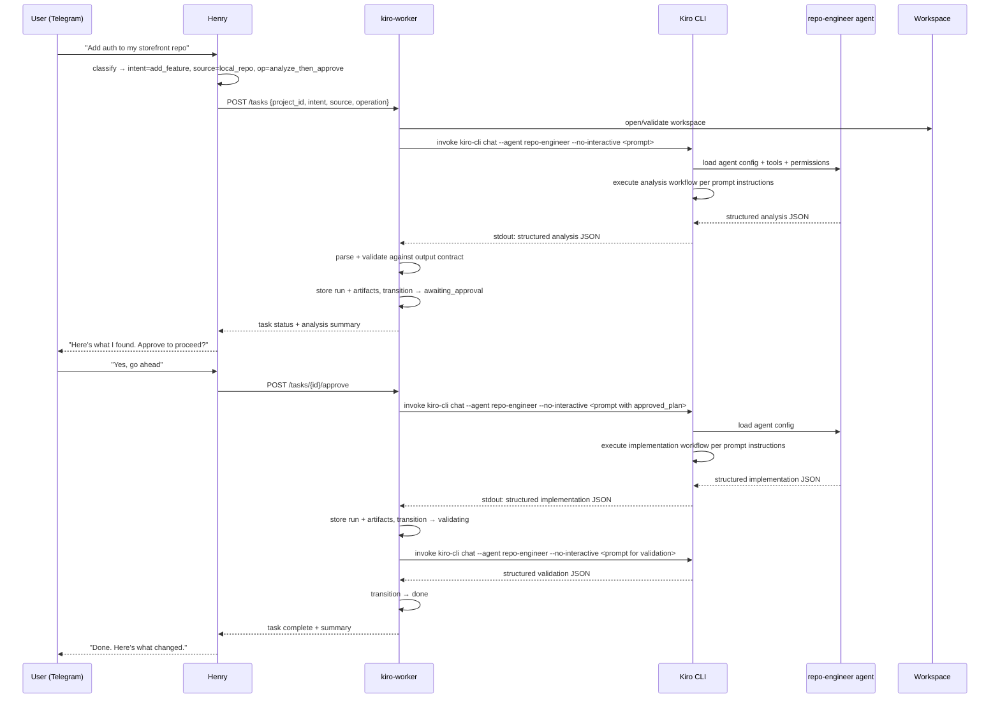
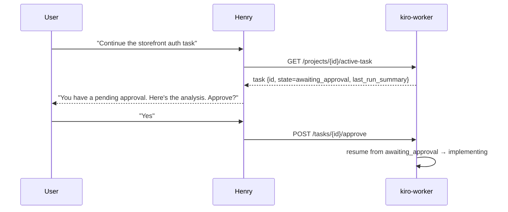

# architecture.md — System Architecture Contract

## Purpose

This document defines the role of every layer in the system, the boundaries between them, and the rules that must not be violated. It is the contract that all Phase 1+ implementation must respect.

**Critical principle:** Kiro already provides significant native capabilities. This architecture uses them intentionally and does not rebuild what Kiro gives us. See `kiro-native-capabilities.md` for the explicit build-vs-use map.

---

## System Layers

| Layer | Component | Role |
|---|---|---|
| UI | Telegram | User-facing interface only. Sends messages, receives replies. No business logic. |
| Orchestrator | Project Lead / Project Manager (e.g. Henry, OpenClaw agent) | Handles user-facing conversation, presents specialist findings, recommends next steps, creates new tasks based on user decisions. Thin by design. |
| Routing rules | Project Lead skill | Encodes routing logic, clarification policy, summary formatting, next-task creation. |
| System of record | kiro-worker | Backend. Owns all project/task/run/artifact state. Calls specialist CLIs. Enforces action-level approval policy. |
| Engineering execution | Kiro CLI (specialist) | Executes analysis, implementation, validation. Invoked as subprocess by worker. |
| Role configuration | Kiro custom agents | Per-role tool permissions, model selection, resource access, system prompt. Defined in `.kiro/agents/`. |
| Persistent context | `.kiro/steering/` + `AGENTS.md` | Engineering standards and workspace context. `AGENTS.md` is always included. Steering files must be explicitly declared in the agent's `resources` to be loaded. |
| Reusable workflows | Kiro skills | Portable workflow instruction packages. Used for analysis and implementation workflows. |
| Continuity | Workspace + Registry | Filesystem workspaces + SQLite registry. Provides resume, lookup, artifact storage. |

**Scalability note:** The specialist execution layer (currently Kiro) is designed to be replaceable or extended with other specialist agents (deployment, UI testing, QA, security, infra/ops). Each specialist follows the same pattern: bounded execution, structured output, `done` on completion, `awaiting_revision` when blocked on input.

---

## Layer Responsibilities

### Telegram

- Render messages from Henry
- Capture user input and forward to Henry
- No knowledge of tasks, projects, or execution state

### Project Lead / Project Manager (e.g. Henry)

**Owns:**
- User-facing conversation
- Presenting specialist findings to the user
- Strategic recommendations (implement, research more, deploy, test, stop)
- Creating new tasks based on user decisions
- Worker API calls
- Result summarization for the user

**Does not own:**
- Project or task state
- Workspace paths or repo logic
- Specialist execution or output parsing
- Action-level approval decisions (those are in the worker)

**Rule:** The Project Lead must remain thin. If it is doing repo reasoning, execution logic, or state management, the architecture is wrong.

**Post-analysis flow:** When a specialist completes an analysis task (`done`), the Project Lead presents the findings and asks the user what to do next. If the user approves implementation, the Project Lead creates a NEW task with `operation: implement_now`. It does NOT revive the old task or call `/approve` on it.

### Henry skill (project-routing-and-delivery)

- Routing rules: which worker endpoint to call for which intent
- Clarification rules: when to ask, what to ask, when to proceed without asking
- Approval rules: how to present approval requests, how to handle yes/no
- Summary formatting: how to present task status, analysis results, implementation summaries
- Analyze vs implement policy: default to `analyze_then_approve` unless user explicitly says `implement_now`

**Does not contain:**
- Repo-specific execution logic
- Shell orchestration
- State persistence
- Kiro output parsing

### kiro-worker

**Owns:**
- All persistent state: projects, workspaces, tasks, runs, artifacts
- Workspace lifecycle: create, open, clone, validate
- Task state machine: transitions, validation, approval enforcement
- Kiro CLI invocation: subprocess call, stdout/stderr capture, JSON parsing, failure handling
- Approval policy enforcement: which operations require approval before proceeding
- Audit log: every state transition and Kiro invocation recorded

**Does not own:**
- User communication (that is Henry's job)
- Telegram-specific formatting
- Henry's classification logic
- Kiro session history (worker DB is the system of record, not Kiro's internal history)

**Rule:** The worker is the single source of truth. If state exists somewhere else, it is a cache or a view — not authoritative.

### Kiro CLI + Custom Agents

**Kiro CLI owns:**
- Engineering execution: analysis, implementation, validation
- Structured output production (see `kiro-output-contract.md`)
- Loading and applying custom agent configuration
- Always including `AGENTS.md` in every agent invocation automatically
- Loading steering files **only if** they are declared in the agent's `resources` configuration
- Executing skills as workflow instructions

**Kiro custom agents own:**
- Tool permissions per role (which tools the agent can use)
- Model selection per role
- Resource access per role (which files/paths are in scope)
- Role-specific system prompt

**Does not own:**
- Task state (receives context, does not persist anything)
- Approval decisions
- Workspace management

**Rule:** Kiro must always return structured JSON. Prose-only output is treated as a parse failure. Custom agents replace prompt-only roles — do not define roles as prompt strings in the worker.

### `.kiro/steering/` + `AGENTS.md`

- `AGENTS.md`: **always included** by Kiro in every agent invocation, regardless of agent config. No explicit declaration needed. Contains: project overview, tech stack, key conventions, what not to do.
- `.kiro/steering/`: directory of steering files. **Not automatically included for custom agents.** To load steering files in a custom agent, they must be explicitly declared in the agent's `resources` array using a glob pattern (e.g., `"file://.kiro/steering/**/*.md"`). Without this declaration, steering files are ignored when the agent runs.
- **Purpose:** Persistent engineering standards that do not need to be re-explained on every invocation. `AGENTS.md` is the zero-config baseline; steering files are the opt-in standards layer that must be wired into each custom agent.

**What this replaces:** Ad-hoc context injection in every prompt. `AGENTS.md` is always present at no cost. Steering files, once declared in the agent's resources, are consistently loaded without the worker needing to inject them.

### Kiro skills

- Portable, reusable workflow instruction packages
- Phase 1 skills: `analysis-workflow` (how to analyze a repo task), `implementation-workflow` (how to implement a bounded change), `validation-workflow` (how to run validation commands and report pass/fail)
- Skills are invoked by the worker as part of the Kiro CLI call
- **What this replaces:** Ad-hoc prompt construction in the worker adapter. Skills make the workflow instructions version-controlled and reusable across projects.

### Workspace + Registry

- SQLite database: projects, workspaces, tasks, runs, artifacts tables
- Filesystem: one workspace directory per project, stable path
- Registry provides: project lookup by id/alias, active task resolution, last run summary, artifact paths
- **Not Kiro session history.** The worker DB is authoritative. Kiro session history is ephemeral and not relied upon for resume or state reconstruction.

---

## Intent / Source / Operation Model

Every request Henry receives is classified into three dimensions before calling the worker.

### Intent

| Value | Meaning |
|---|---|
| `new_project` | Start a brand new project from scratch |
| `add_feature` | Add a feature to an existing project |
| `refactor` | Refactor or restructure existing code |
| `fix_bug` | Fix a specific bug or regression |
| `analyze_codebase` | Understand the repo without making changes |
| `upgrade_dependencies` | Update dependencies, handle breaking changes |
| `prepare_pr` | Prepare a pull request from existing work |

### Source

| Value | Meaning |
|---|---|
| `new_project` | No existing repo; worker creates workspace from scratch |
| `github_repo` | Clone a GitHub repository into a managed workspace |
| `local_repo` | Open an existing local git repository |
| `local_folder` | Open a local folder that may not be a git repo |

### Operation Mode

| Value | Meaning | Approval required? |
|---|---|---|
| `plan_only` | Produce a plan, no code changes | No |
| `analyze_then_approve` | Analyze first, wait for approval before implementing | Yes (before implement) |
| `implement_now` | Implement immediately without analysis step | Only for destructive/push actions |
| `implement_and_prepare_pr` | Implement and prepare a PR | Yes (before push) |

**Default operation mode:** `analyze_then_approve` unless user explicitly requests otherwise.

---

## Kiro Invocation Model

The worker invokes `kiro-cli` as a subprocess using the `chat` subcommand:

```
kiro-cli chat --agent <agent> --no-interactive <prompt>
```

Run with `cwd=workspace_path`.

| Parameter | Source | Notes |
|---|---|---|
| `--agent` | worker config | Which agent/context profile to use (e.g., `repo-engineer`) |
| `--no-interactive` | always set | Runs headlessly without waiting for user input — required for subprocess use |
| `<prompt>` | task + run record | Constructed by the worker: skill name, task context (intent, description, prior analysis, approved plan), and output schema instructions |

The worker captures stdout, attempts JSON parse, validates against the output contract schema, and stores the result. If parse fails, the run is marked `parse_failed` and the task transitions to `failed`.

**Note:** `kiro-cli` (the terminal CLI at `~/.local/bin/kiro-cli`) is a separate binary from the Kiro IDE launcher (`/usr/bin/kiro`). Install with: `curl -fsSL https://cli.kiro.dev/install | bash`

### Custom Agent: `repo-engineer` (Phase 1)

```json
{
  "name": "repo-engineer",
  "description": "General-purpose engineering agent for analysis, implementation, and validation",
  "model": "claude-sonnet-4-5",
  "tools": [
    "read",
    "write",
    "shell",
    "search_files",
    "get_diagnostics"
  ],
  "toolsSettings": {
    "shell": {
      "allowedCommands": ["npm *", "yarn *", "pnpm *", "python *", "pytest *", "cargo *", "go *", "git status", "git diff"],
      "deniedCommands": ["git push *", "git commit *", "rm -rf *"]
    }
  },
  "resources": [
    "file://.kiro/steering/**/*.md"
  ]
}
```

**Notes:**
- `AGENTS.md` is always included by Kiro automatically — no resource declaration needed.
- `.kiro/steering/**/*.md` is explicitly declared in `resources` because steering files are **not** auto-loaded for custom agents. Without this line, steering files would be silently ignored.
- `model` is configurable per deployment. The above is a default.
- Tool names follow the Kiro CLI built-in tool naming convention (`read`, `write`, `shell`).

---

## Approval Policy

### Actions that always require approval

- Any implementation after analysis (in `analyze_then_approve` mode)
- Destructive file operations (delete, overwrite without backup)
- Push to remote branch
- PR creation or merge
- Major architectural changes (as flagged by Kiro in analysis output)
- Any action on a repo the worker has not previously opened (first-time access)

### Actions that are safe without approval

- Analysis and read-only inspection
- Plan generation
- Creating a new workspace (no existing code at risk)
- Retrieving task status or run history
- Resuming a previously approved task that was interrupted

### Approval enforcement

The worker enforces approval — not Henry, not Kiro. When a task reaches `awaiting_approval`, the worker will not transition to `implementing` until it receives an explicit `POST /tasks/{id}/approve` call. Henry relays the approval from the user; the worker enforces the gate.

---

## Execution Flow

### Standard analyze-then-approve flow



### Resume flow



**Resume rule:** Worker reconstructs Kiro context from its own DB (task record + last run artifacts). It does not rely on Kiro session history. Every Kiro invocation is stateless from Kiro's perspective; the worker provides all necessary context.

---

## State Ownership: Worker vs Kiro

This table is the definitive answer to "where does X live?"

| Data | Owner | Notes |
|---|---|---|
| Project metadata (name, source, workspace path) | kiro-worker DB | Authoritative |
| Task state (current state, transitions, timestamps) | kiro-worker DB | Authoritative |
| Run records (invocation params, raw output, parse status) | kiro-worker DB | Authoritative |
| Artifacts (analysis JSON, implementation JSON, validation JSON) | kiro-worker DB + filesystem | DB has metadata; filesystem has full content |
| Approval status | kiro-worker DB | Enforced by worker, not Kiro |
| Engineering standards and conventions | `.kiro/steering/` + `AGENTS.md` | `AGENTS.md` always loaded by Kiro; steering loaded only if declared in agent resources |
| Role configuration (tools, model, permissions) | `.kiro/agents/` | Loaded by Kiro CLI; version-controlled in workspace |
| Workflow instructions | Kiro skills | Loaded by Kiro CLI; version-controlled |
| Kiro session history | Kiro (ephemeral) | Not relied upon; not authoritative; not used for resume |

---

## Why the Worker is the Source of Truth

1. Henry is stateless by design — he cannot be the source of truth
2. Kiro CLI is invoked as a subprocess — it receives context, executes, returns output, done
3. Telegram is a UI — it has no persistence
4. The workspace filesystem holds code artifacts but not task metadata
5. Only the worker has a persistent store (SQLite) that survives restarts, reconnects, and agent crashes
6. Kiro session history is ephemeral and not designed to be the authoritative record of what happened

**Consequence:** Any component that needs to know "what is the current state of task X" must ask the worker. No component should maintain its own copy of task state.

---

## Why Henry Must Remain Thin

Henry's value is judgment and communication, not execution. If Henry accumulates execution logic:

- The system becomes prompt-fragile (Henry's behavior changes with model updates)
- State gets split between Henry's context and the worker's DB
- Debugging becomes impossible (which layer made the decision?)
- Scaling to multiple users or concurrent tasks breaks

**The rule:** Henry knows what to do. The worker knows what is happening. Kiro knows how to do it.

---

## Why Custom Agents Instead of Prompt-Only Roles

A prompt-only role system (injecting role descriptions as text in every prompt) has these problems:

- Tool permissions are implicit and unenforceable
- Model selection is not per-role
- Role definitions are not version-controlled as first-class config
- Every invocation must re-inject the role description

Kiro custom agents solve all of these:

- Tool permissions are explicit and enforced by Kiro
- Model is configured per agent
- Agent config lives in `.kiro/agents/` — version-controlled, auditable
- Role description is in the agent config, not re-injected every time

**Rule:** Do not define engineering roles as prompt strings in the worker. Define them as Kiro custom agents.

---

## Why Steering Instead of Re-Prompting Standards

Without `.kiro/steering/` and `AGENTS.md`, every Kiro invocation must include:
- Project overview
- Tech stack
- Coding conventions
- What not to do
- Architecture decisions

This is expensive (tokens), fragile (easy to forget), and inconsistent (different invocations may include different context).

With steering + AGENTS.md:
- `AGENTS.md` is always loaded by Kiro automatically — zero config, zero risk of omission
- Steering files are loaded consistently once declared in the agent's `resources` — no per-invocation injection needed
- Both are version-controlled alongside the code
- The worker does not need to manage context injection for standards

**Important:** Steering files are **not** auto-loaded for custom agents. They must be declared explicitly:
```json
{ "resources": ["file://.kiro/steering/**/*.md"] }
```
Without this declaration in the agent config, steering files are silently absent from every invocation.

**Rule:** Engineering standards belong in `.kiro/steering/` (declared in agent resources) and `AGENTS.md` (always present). The worker's context injection is for task-specific data only (task description, prior analysis, approved plan).

---

## Scalability Notes (Future Phases)

These are not Phase 1 concerns but the architecture must not block them:

- Multiple Kiro custom agents (repo-analyst, backend-engineer, frontend-engineer, test-engineer, pr-writer) — worker routes to the right agent; Henry does not care
- Kiro subagents for parallel work — worker spawns multiple Kiro invocations; output contract handles multi-agent results
- MCP for external tool integration — added to custom agent config when justified
- Kiro hooks for lifecycle automation — added to workspace when justified
- Project aliases and registry search — worker adds alias table; API adds `/projects/by-alias/{alias}`
- Multi-user — worker adds `owner_id` to projects/tasks; approval calls include auth token
- PR workflow — worker adds branch/commit/PR state to runs; new endpoints for push/PR
- Permissions hardening — worker adds safe-root enforcement, action allowlist per project

None of these require changes to the Henry/worker boundary or the output contract.
