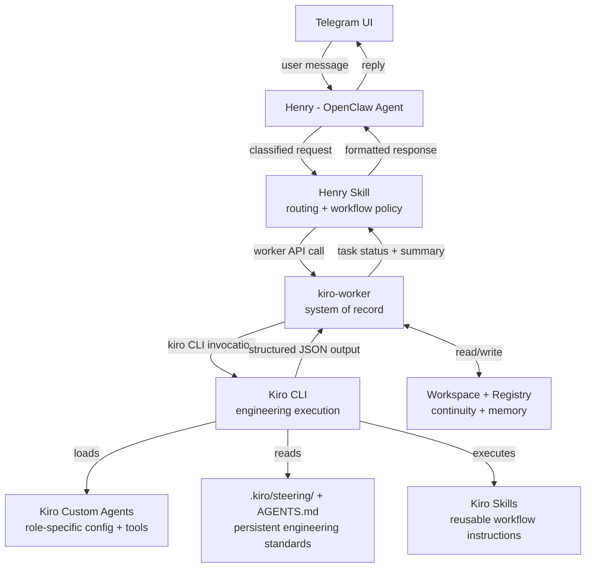

# Design Document: kiro-worker-architecture-phase0

## Executive Summary

This is the Phase 0 architecture contract freeze for the scalable software-delivery orchestration system. Nothing in this document is implementation — it is the set of contracts, boundaries, and decisions that must not move once Phase 1 begins.

The system is a multi-layer delivery pipeline: Telegram is the UI, Henry (OpenClaw agent) is the PM/tech-lead/orchestrator, kiro-worker is the backend system of record, and Kiro CLI is the engineering execution layer. The workspace and registry provide continuity and memory across sessions.

**Critical design principle:** Kiro already provides significant native capabilities (custom agents, steering, skills, code intelligence, session persistence, MCP, hooks, subagents). The architecture must use these intentionally and must not rebuild what Kiro already gives us.

The six documents in this pack define the full contract surface for Phase 1 implementation:

1. `architecture.md` — System roles, boundaries, approval/execution flow, and Kiro-native integration points
2. `task-model.md` — Domain model: Project, Workspace, Task, Run, Artifact; what state lives in worker vs Kiro
3. `state-machine.md` — Task lifecycle, transitions, approval checkpoints, resume rules
4. `worker-api.md` — First stable API contract for kiro-worker
5. `kiro-output-contract.md` — Structured output schema Kiro must return to the worker
6. `kiro-native-capabilities.md` — Explicit map of what Kiro provides vs what we build; use/defer/avoid decisions

---

## Architecture Overview



Henry is thin by design. He classifies intent, calls the worker, and communicates results. He does not own state, execution logic, or repo knowledge. The worker owns all of that.

Kiro CLI is the engineering execution layer. Custom agents define role-specific tool permissions, model selection, and resource access. Steering and AGENTS.md carry persistent engineering standards so we do not re-explain them on every invocation. Skills carry reusable workflow instructions.

---

## Architecture Layers

| Layer | Component | Role |
|---|---|---|
| UI | Telegram | User-facing interface only. No business logic. |
| Orchestrator | Henry (OpenClaw agent) | PM / tech lead. Classifies, calls worker, communicates. Thin by design. |
| Routing rules | Henry skill | Routing logic, clarification policy, approval rules, summary formatting. |
| System of record | kiro-worker | Backend. Owns all project/task/run/artifact state. Calls Kiro CLI. Enforces approval policy. |
| Engineering execution | Kiro CLI | Executes analysis, implementation, validation via custom agents. |
| Role configuration | Kiro custom agents | Per-role tool permissions, model, resources, prompt. Replaces prompt-only role system. |
| Persistent context | .kiro/steering/ + AGENTS.md | Engineering standards, conventions, always-included context. Replaces re-explaining standards. |
| Reusable workflows | Kiro skills | Portable workflow instruction packages. Replaces ad-hoc prompt construction. |
| Continuity | Workspace + Registry | Filesystem workspaces + SQLite registry. Resume, lookup, artifact storage. |

---

## What We Build vs What Kiro Provides

This is the most important design decision in Phase 0. See `kiro-native-capabilities.md` for the full breakdown.

**We build:**
- kiro-worker: persistent state, task lifecycle, approval enforcement, audit log
- Workspace manager: four source modes, path safety, git operations
- Worker API: the 11 HTTP endpoints Henry calls
- Kiro invocation adapter: CLI subprocess, stdout capture, JSON parse, failure handling
- Henry skill: routing rules, clarification policy, summary formatting

**Kiro provides (use immediately):**
- Custom agents for each engineering role (repo-engineer in Phase 1)
- `.kiro/steering/` + `AGENTS.md` for persistent engineering standards
- Skills for reusable workflow instructions (analysis workflow, implementation workflow)
- Built-in code intelligence (tree-sitter) — do not build a custom code-intelligence layer in v1

**Kiro provides (use later):**
- Subagents for parallel/specialized work (Phase 9+)
- Session persistence/resume at the Kiro level (worker handles resume in v1)
- MCP for external tool integration (Phase 5+)
- Hooks for lifecycle automation (Phase 7+)

**Do not build:**
- A custom code-intelligence layer in v1 — Kiro's tree-sitter handles this
- A prompt-only role system — use Kiro custom agents instead
- Custom session history — kiro-worker is the system of record, not Kiro session history

---

## Phase-1 Readiness Review

### What is strong

- Role boundaries are unambiguous: Henry = orchestrator, worker = backbone, Kiro CLI = executor
- Custom agents replace prompt-only roles — role config is explicit and version-controlled
- `AGENTS.md` is always included automatically; `.kiro/steering/` is loaded only when explicitly declared in the agent's `resources` — engineering standards are consistently available without re-explaining them on every invocation
- The Intent/Source/Operation model gives Henry a clean classification surface
- The state machine covers the full delivery loop including approval, revision, and resume
- The output contract forces Kiro to be machine-readable from day one
- The API surface is minimal and maps directly to real user actions
- kiro-native-capabilities.md makes the build-vs-use boundary explicit and auditable

### What is ambiguous

- Workspace path resolution for `local_folder` (non-git) sources needs a concrete convention
- Approval policy thresholds ("non-trivial") need a working definition before Phase 1 ships
- How Henry surfaces approval requests in Telegram (inline buttons vs text reply) is not defined here — that is a Henry concern, not a worker concern
- Multi-workspace per project is not modeled in v1; assume one active workspace per project
- Which Kiro model to use per custom agent role is not locked — leave as configurable

### What Kiro-native capabilities should be used immediately

| Capability | Use in Phase 1 | Reason |
|---|---|---|
| Custom agents | Yes — define `repo-engineer` agent | Replaces prompt-only role; gives explicit tool permissions and model config |
| `.kiro/steering/` | Yes — add engineering standards | Declared in agent `resources`; stops us re-explaining conventions on every invocation |
| `AGENTS.md` | Yes — add always-included context | Workspace-level context that every agent invocation sees |
| Skills | Yes — define analysis + implementation skills | Reusable workflow instructions; cleaner than ad-hoc prompt construction |
| Built-in code intelligence | Yes — rely on it, do not replicate | tree-sitter is already there; no custom code-intelligence layer needed |
| Session persistence | No — worker handles resume | Worker is system of record; Kiro session history is not authoritative |
| Subagents | No — single agent in Phase 1 | Add in Phase 9 when multi-role team is needed |
| MCP | No — not needed in Phase 1 | Add when external tool integration is justified |
| Hooks | No — not needed in Phase 1 | Add in Phase 7 for lifecycle automation |

### What to build first (Phase 1 order)

1. DB schema (projects, workspaces, tasks, runs, artifacts)
2. Workspace manager (four source modes)
3. Task state machine (persisted transitions)
4. Kiro custom agent definition (`repo-engineer`)
5. `.kiro/steering/` + `AGENTS.md` with engineering standards
6. Kiro skills for analysis and implementation workflows
7. Kiro adapter (CLI invocation → stdout → JSON parse → store)
8. Worker API endpoints (the 11 routes in worker-api.md)

### What NOT to build yet

- Henry skill formalization (Phase 4)
- Multi-role Kiro team (Phase 9)
- Branch/commit/PR workflow (Phase 10)
- Permission hardening beyond basic safe-root checks (Phase 11)
- Project aliases and registry search (Phase 8)
- Planning/spec layer (Phase 6)
- MCP integrations (Phase 5+)
- Kiro hooks (Phase 7+)
- Kiro subagents (Phase 9+)

---

## Machine-Readable Summary

```json
{
  "headline": "Phase 0 architecture contract freeze for kiro-worker orchestration system using Kiro CLI as engineering execution layer",
  "documents_created": [
    "architecture.md",
    "task-model.md",
    "state-machine.md",
    "worker-api.md",
    "kiro-output-contract.md",
    "kiro-native-capabilities.md"
  ],
  "key_decisions": [
    "Henry is thin: classify + call + communicate only; no state ownership",
    "kiro-worker is the single system of record for all project/task/run state; NOT Kiro session history",
    "Kiro CLI is the engineering execution layer; custom agents define role-specific config",
    "Kiro custom agents replace prompt-only roles — tool permissions, model, resources are explicit",
    ".kiro/steering/ + AGENTS.md carry persistent engineering standards; do not re-explain on every invocation",
    "Kiro skills carry reusable workflow instructions; use for analysis and implementation workflows",
    "Do not build a custom code-intelligence layer in v1 — rely on Kiro's built-in tree-sitter",
    "Kiro agents must always return structured JSON; prose-only output is a parse failure",
    "Approval is required before any non-trivial implementation, destructive action, or push/PR",
    "Intent/Source/Operation is the canonical classification model for all Henry requests",
    "Four source modes: new_project, github_repo, local_repo, local_folder",
    "Task state machine has 9 states with explicit allowed transitions",
    "v1 uses SQLite; schema is designed to migrate to Postgres without model changes",
    "One active workspace per project in v1",
    "Kiro output contract is versioned from day one (schema_version field)"
  ],
  "assumptions": [
    "Henry already exists and can make HTTP calls to the worker",
    "Kiro CLI can be invoked as a subprocess from the worker",
    "Kiro custom agents can be defined per workspace in .kiro/agents/",
    "Workspace root is a configurable safe path; worker enforces it",
    "GitHub access uses a pre-configured token; no OAuth flow in Phase 1",
    "Local folder source mode does not require git init; worker handles it",
    "A single repo-engineer Kiro custom agent is sufficient for Phase 1 and Phase 2",
    "Telegram approval is a simple yes/no reply or button; worker just checks approved boolean",
    "Kiro's built-in tree-sitter code intelligence is sufficient for Phase 1 repo analysis"
  ],
  "phase_1_recommendation": [
    "Build kiro-worker DB schema first — everything else depends on it",
    "Implement workspace manager for all four source modes before task logic",
    "Wire state machine to DB transitions with explicit validation — no free-form status strings",
    "Define repo-engineer Kiro custom agent with explicit tool permissions before writing prompts",
    "Add .kiro/steering/ and AGENTS.md with engineering standards before first Kiro invocation",
    "Define analysis and implementation Kiro skills before building the adapter",
    "Build Kiro adapter with CLI subprocess, stdout capture, and JSON parse",
    "Expose the 11 API endpoints and test the full loop manually before connecting Henry"
  ],
  "not_in_phase_0": [
    "Henry skill formalization",
    "Multi-role Kiro team",
    "Branch/commit/PR workflow",
    "Permission hardening beyond safe-root enforcement",
    "Project aliases and registry search",
    "Planning and spec layer",
    "Telegram UI specifics",
    "OAuth or GitHub App integration",
    "Multi-workspace per project",
    "MCP integrations",
    "Kiro hooks",
    "Kiro subagents"
  ],
  "kiro_native_features_used": [
    "custom_agents: repo-engineer agent defined with explicit tool permissions, model, and resources",
    "steering: .kiro/steering/ directory with engineering standards; must be declared in agent resources via 'file://.kiro/steering/**/*.md' to take effect — not auto-loaded for custom agents",
    "agents_md: AGENTS.md with always-included workspace context",
    "skills: analysis-workflow and implementation-workflow skills for reusable instructions",
    "code_intelligence: rely on built-in tree-sitter; no custom layer built in v1"
  ]
}
```

---

## Correctness Properties

*A property is a characteristic or behavior that should hold true across all valid executions of a system — essentially, a formal statement about what the system should do. Properties serve as the bridge between human-readable specifications and machine-verifiable correctness guarantees.*

### Property 1: Cross-document state name consistency

For any Phase 0 document that references a task state name, that state name must be one of the 9 canonical states defined in `state-machine.md` (`created`, `opening`, `analyzing`, `awaiting_approval`, `implementing`, `validating`, `awaiting_revision`, `done`, `failed`). No document may introduce a state name not in this set.

**Validates: Requirements 7.1, 3.1**

### Property 2: Cross-document API endpoint consistency

For any Phase 0 document that references a worker API endpoint path, that path must be defined in `worker-api.md`. No document may reference an endpoint that does not exist in the API contract.

**Validates: Requirements 7.2, 3.7, 4.1**

### Property 3: Cross-document entity field consistency

For any Phase 0 document that references a domain entity field by name, that field must be defined in `task-model.md`. No document may reference a field that is not in the domain model.

**Validates: Requirements 7.3, 2.2**

### Property 4: Cross-document output schema consistency

For any Phase 0 document that references a Kiro output schema (analysis, implementation, or validation), that schema must be defined in `kiro-output-contract.md`. No document may reference a schema that is not in the output contract.

**Validates: Requirements 7.4, 5.1, 5.2, 5.3**

### Property 5: Cross-document capability decision consistency

For any Phase 0 document that states a Kiro capability decision (use / defer / avoid), that decision must be consistent with the decision recorded in `kiro-native-capabilities.md`. No document may contradict the capability map.

**Validates: Requirements 7.5, 11.1, 11.2, 11.3, 11.4, 11.5, 11.6**

### Property 6: No blocking TBD content

For any section in any Phase 0 document, the section must not contain unresolved placeholders ("TBD", "TODO", "to be determined", "to be defined") that would prevent a Phase 1 implementer from making a concrete implementation decision.

**Validates: Requirements 7.6**

### Property 7: Schema version field presence

For any output schema defined in `kiro-output-contract.md` (analysis, implementation, validation), the schema must include a `schema_version` field. This property holds for all three schemas without exception.

**Validates: Requirements 5.4, 12.4**

### Property 8: Approval gate endpoint exclusivity

For any task in the `awaiting_approval` state, the only valid mechanism to transition it to `implementing` is a call to `POST /tasks/{id}/approve`. No other endpoint, state transition, or Kiro invocation may bypass this gate.

**Validates: Requirements 10.4, 10.5, 9.5**

### Property 9: Intent/Source/Operation enum completeness

For any request classification in any Phase 0 document, the Intent, Source, and Operation values used must be drawn exclusively from the enums defined in `architecture.md`. No document may introduce classification values outside these enums.

**Validates: Requirements 8.1, 8.2, 8.3, 2.3**

### Property 10: Resume context reconstruction from worker DB

For any task resume operation described in any Phase 0 document, the resume mechanism must reconstruct context exclusively from the worker DB (task record, run records, artifacts). No resume operation may depend on Kiro session history.

**Validates: Requirements 9.3, 9.2, 6.1**
