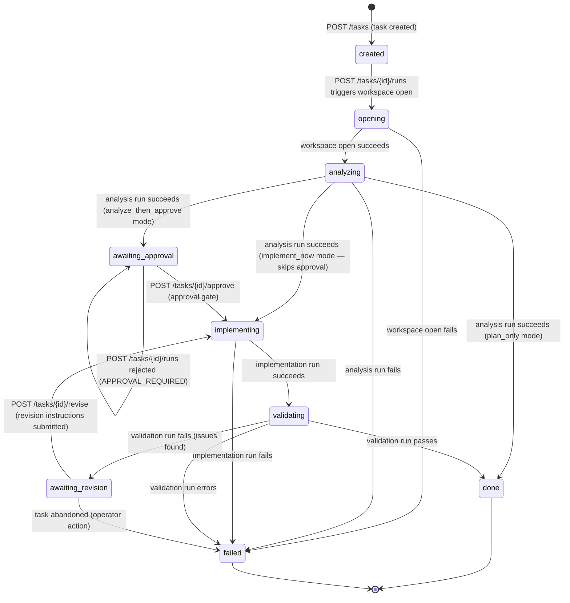

# state-machine.md — Task Lifecycle State Machine Contract

## Purpose

This document defines the complete task lifecycle for kiro-worker: all 9 canonical states, every allowed transition, approval gate rules, resume rules, and failure rules. It is the contract that Phase 1 state machine implementation must follow exactly.

**Cross-references:**
- Domain model and entity fields → `task-model.md`
- System layer responsibilities and approval policy → `architecture.md` § Approval Policy
- API endpoints that trigger transitions → `worker-api.md` (created in task 3; endpoint paths listed here are the 11 canonical paths)

---

## The 9 Canonical States

These are the only valid values for `tasks.status`. No other values are permitted.

| State | Description | Terminal? | Resumable? |
|---|---|---|---|
| `created` | Task record exists in DB; workspace not yet opened | No | No |
| `opening` | Worker is opening, cloning, or validating the workspace | No | No |
| `analyzing` | Kiro CLI is running the `analysis-workflow` skill | No | No |
| `awaiting_approval` | Analysis complete; waiting for explicit user approval before implementing | No | Yes |
| `implementing` | Kiro CLI is running the `implementation-workflow` skill | No | No |
| `validating` | Kiro CLI is running the `validation-workflow` skill | No | No |
| `awaiting_revision` | Validation found issues; waiting for user direction on how to proceed | No | Yes |
| `done` | Task complete; all runs stored; artifacts available | Yes | No |
| `failed` | Terminal failure; see `failure_reason` on the last Run record | Yes | No |

**Terminal states:** `done` and `failed`. No transition out of a terminal state is permitted.

**Resumable states:** `awaiting_approval` and `awaiting_revision`. These are the only states where the task is paused waiting for human input and can be continued after a worker restart or reconnect.

---

## State Transition Table

Every allowed transition is listed here. Any transition not in this table is forbidden. The worker must reject any attempt to move a task to a state not reachable from its current state.

| # | From | To | Trigger | Actor | Approval Gate? | Automatic? |
|---|---|---|---|---|---|---|
| T1 | `created` | `opening` | `POST /tasks/{id}/runs` (mode=analyze) or workspace open initiated | Worker (internal) | No | Yes — immediately after task creation when a run is triggered |
| T2 | `opening` | `analyzing` | Workspace open/clone/validate succeeds | Worker (internal) | No | Yes |
| T3 | `opening` | `failed` | Workspace open/clone/validate fails | Worker (internal) | No | Yes |
| T4 | `analyzing` | `awaiting_approval` | Kiro CLI analysis run completes successfully; artifact stored | Worker (internal) | No | Yes |
| T5 | `analyzing` | `failed` | Kiro CLI analysis run fails (non-zero exit, timeout, parse failure, schema invalid) | Worker (internal) | No | Yes |
| T6 | `awaiting_approval` | `implementing` | `POST /tasks/{id}/approve` received | Henry (on behalf of user) | **Yes — approval gate** | No — requires explicit API call |
| T7 | `awaiting_approval` | _(no transition)_ | `POST /tasks/{id}/runs` called without prior approval | Worker (internal) | N/A | Yes — immediate rejection with 409 `APPROVAL_REQUIRED`; task stays in `awaiting_approval` |
| T8 | `implementing` | `validating` | Kiro CLI implementation run completes successfully; artifact stored | Worker (internal) | No | Yes |
| T9 | `implementing` | `failed` | Kiro CLI implementation run fails | Worker (internal) | No | Yes |
| T10 | `validating` | `done` | Kiro CLI validation run completes with pass status | Worker (internal) | No | Yes |
| T11 | `validating` | `awaiting_revision` | Kiro CLI validation run completes with fail status (issues found) | Worker (internal) | No | Yes |
| T12 | `validating` | `failed` | Kiro CLI validation run fails (non-zero exit, timeout, parse failure) | Worker (internal) | No | Yes |
| T13 | `awaiting_revision` | `implementing` | `POST /tasks/{id}/revise` received with revision instructions | Henry (on behalf of user) | No | No — requires explicit API call |
| T14 | `awaiting_revision` | `failed` | Worker receives explicit abandon signal (future phase) or operator marks failed | Worker (internal) | No | No |

**Notes on T7:** If `POST /tasks/{id}/runs` is called while the task is in `awaiting_approval`, the worker rejects the request with HTTP 409 and error code `APPROVAL_REQUIRED`. The task does NOT transition to `failed` — it remains in `awaiting_approval`. T7 is listed for completeness but is a rejection, not a state transition.

**Notes on T13:** After `POST /tasks/{id}/revise`, the worker transitions to `implementing` and immediately triggers a new Kiro CLI implementation run using the revision instructions as additional context. No separate run trigger is needed.

**Notes on T1:** The `created → opening` transition is triggered when the worker processes the first run request for the task. In the standard flow, `POST /tasks/{id}/runs` with `mode=analyze` is the trigger. The worker opens the workspace as part of processing this request.

---

## Approval Gate

### Which transitions require an approval gate

Only **T6** (`awaiting_approval → implementing`) requires an approval gate. All other transitions are either automatic (worker-driven) or triggered by non-approval API calls.

### Approval gate enforcement rules

1. The worker enforces the approval gate — not Henry, not Kiro CLI.
2. `POST /tasks/{id}/approve` is the **only** mechanism to transition a task out of `awaiting_approval`. No other endpoint, internal event, or Kiro invocation may bypass this gate.
3. When a task is in `awaiting_approval`, any call to `POST /tasks/{id}/runs` is rejected with HTTP 409 and error code `APPROVAL_REQUIRED`. The task remains in `awaiting_approval`.
4. On receiving `POST /tasks/{id}/approve`, the worker:
   a. Validates the task is in `awaiting_approval` state. If not, returns HTTP 409 with error code `INVALID_STATE_FOR_APPROVAL`.
   b. Sets `tasks.approved_at` to the current UTC timestamp.
   c. Transitions the task to `implementing`.
   d. Immediately triggers a new Kiro CLI invocation with the `implementation-workflow` skill, passing the approved analysis artifact as context.
5. Approval is idempotent in the sense that calling `POST /tasks/{id}/approve` on a task already in `implementing` or beyond returns HTTP 409 with `INVALID_STATE_FOR_APPROVAL` — it does not re-trigger implementation.

### What "non-trivial implementation" means

Per `architecture.md`, approval is required before any non-trivial implementation. For the purposes of the state machine, **all** `analyze_then_approve` and `implement_and_prepare_pr` operation mode tasks require approval before implementing. The approval gate is unconditional for these operation modes. For `implement_now` tasks, the worker skips the `awaiting_approval` state entirely and transitions directly from `analyzing` to `implementing` (or from `opening` to `implementing` if no analysis step is configured).

**Operation mode → approval gate mapping:**

| Operation | Approval gate required? | Notes |
|---|---|---|
| `plan_only` | No | Task ends at `analyzing` → `done` (no implementation) |
| `analyze_then_approve` | Yes | Standard flow; approval gate at `awaiting_approval` |
| `implement_now` | No | Skips `awaiting_approval`; goes directly to `implementing` |
| `implement_and_prepare_pr` | Yes | Same gate as `analyze_then_approve`; PR step added after `done` in future phase |

---

## Standard Flow

### analyze_then_approve (default)

```
created → opening → analyzing → awaiting_approval → implementing → validating → done
```

Each arrow represents an automatic transition except `awaiting_approval → implementing`, which requires `POST /tasks/{id}/approve`.

### implement_now

```
created → opening → implementing → validating → done
```

No analysis step, no approval gate. The worker skips directly to implementation.

### plan_only

```
created → opening → analyzing → done
```

No implementation or validation. Task completes after analysis artifact is stored.

### With revision loop

```
created → opening → analyzing → awaiting_approval → implementing → validating → awaiting_revision → implementing → validating → done
```

The `awaiting_revision → implementing → validating` loop may repeat as many times as needed until validation passes or the task is marked `failed`.

---

## Mermaid State Diagram



---

## Resume Rules

### Which states are resumable

| State | Resumable? | Reason |
|---|---|---|
| `created` | No | No work has started; a new run trigger is sufficient |
| `opening` | No | Workspace open is idempotent; re-trigger via `POST /tasks/{id}/runs` |
| `analyzing` | No | Kiro CLI is stateless; re-trigger via `POST /tasks/{id}/runs` |
| `awaiting_approval` | **Yes** | Task is paused waiting for user approval; context is fully stored in DB |
| `implementing` | No | Kiro CLI is stateless; re-trigger via `POST /tasks/{id}/runs` |
| `validating` | No | Kiro CLI is stateless; re-trigger via `POST /tasks/{id}/runs` |
| `awaiting_revision` | **Yes** | Task is paused waiting for user revision instructions; context is fully stored in DB |
| `done` | No | Terminal state |
| `failed` | No | Terminal state |

**Resume definition:** A task is "resumed" when the worker reconstructs its full execution context from the worker DB and issues a fresh Kiro CLI invocation. Resume does not depend on Kiro session history. Every Kiro invocation is stateless from Kiro's perspective; the worker provides all necessary context.

### Context the worker must restore before resuming

The worker constructs the following resume context object from its DB before issuing a fresh Kiro CLI invocation. All fields are sourced exclusively from the worker DB (task record + artifact content). Kiro session history is never consulted.

```json
{
  "task_id": "<tasks.id>",
  "intent": "<tasks.intent>",
  "source": "<tasks.source>",
  "operation": "<tasks.operation>",
  "description": "<tasks.description>",
  "workspace_path": "<workspaces.path>",
  "current_status": "<tasks.status>",
  "prior_analysis": "<content of most recent analysis artifact, or null>",
  "approved_plan": "<content of most recent analysis artifact if tasks.approved_at is set, or null>",
  "revision_instructions": "<revision instructions from POST /tasks/{id}/revise, or null>"
}
```

**Field sources:**

| Field | Source |
|---|---|
| `task_id` | `tasks.id` |
| `intent` | `tasks.intent` |
| `source` | `tasks.source` |
| `operation` | `tasks.operation` |
| `description` | `tasks.description` |
| `workspace_path` | `workspaces.path` via `tasks.workspace_id` |
| `current_status` | `tasks.status` |
| `prior_analysis` | `artifacts.content` WHERE `artifacts.task_id = tasks.id` AND `artifacts.type = 'analysis'` ORDER BY `created_at` DESC LIMIT 1 |
| `approved_plan` | Same as `prior_analysis` if `tasks.approved_at IS NOT NULL`, else null |
| `revision_instructions` | Stored on the most recent `awaiting_revision` transition record (see Failure Rules § stored data) |

### What the worker checks before resuming

Before issuing a fresh Kiro CLI invocation for a resumed task, the worker performs these checks in order:

1. **Workspace exists:** `workspaces.path` is a valid, accessible directory on the filesystem. If not, transition to `failed` with `failure_reason = "workspace_path_not_found: {path}"`.
2. **Workspace is the correct repo:** If `workspaces.git_remote` is set, verify the workspace git remote matches. If mismatch, transition to `failed` with `failure_reason = "workspace_remote_mismatch"`.
3. **Task is in a resumable state:** `tasks.status` is `awaiting_approval` or `awaiting_revision`. If not, return HTTP 409 with `INVALID_STATE_FOR_RESUME`.
4. **Approval is set (for awaiting_approval resume):** If resuming from `awaiting_approval`, verify `tasks.approved_at IS NOT NULL`. If null, the task has not been approved; return HTTP 409 with `APPROVAL_REQUIRED`.
5. **Prior analysis artifact exists (for awaiting_approval resume):** Verify at least one `analysis` artifact exists for the task. If not, transition to `failed` with `failure_reason = "missing_analysis_artifact_for_resume"`.

---

## Failure Rules

### Which states can transition to `failed`

| From State | Failure Trigger | Retry Allowed? |
|---|---|---|
| `opening` | Workspace open/clone/validate fails | Yes — re-trigger via `POST /tasks/{id}/runs` after fixing the source issue |
| `analyzing` | Kiro CLI exits non-zero, times out, returns non-JSON, or returns schema-invalid JSON | Yes — re-trigger via `POST /tasks/{id}/runs` |
| `implementing` | Kiro CLI exits non-zero, times out, returns non-JSON, or returns schema-invalid JSON | Yes — re-trigger via `POST /tasks/{id}/runs` after reviewing the failure |
| `validating` | Kiro CLI exits non-zero, times out, returns non-JSON, or returns schema-invalid JSON | Yes — re-trigger via `POST /tasks/{id}/runs` |
| `awaiting_revision` | Operator explicitly marks task as failed (future phase) | No — terminal |

**Note on retry:** "Retry allowed" means the worker permits a new `POST /tasks/{id}/runs` call to re-attempt the failed phase. The task transitions back to the appropriate in-progress state (`opening`, `analyzing`, `implementing`, or `validating`) when the retry run is triggered. The `failed` state is only terminal when no retry is attempted — it is not a permanent lock unless the operator chooses not to retry.

**Clarification:** `done` and `failed` are the only terminal states. A task in `failed` that has not been retried remains in `failed`. A retry call to `POST /tasks/{id}/runs` on a `failed` task is the mechanism to re-attempt; the worker validates the retry is appropriate before accepting it.

### What is stored on failure

When a task transitions to `failed`, the following data is stored:

**On the Run record** (the run that caused the failure):

| Field | Value stored |
|---|---|
| `runs.status` | `error` (subprocess failure) or `parse_failed` (output parse failure) |
| `runs.parse_status` | `parse_failed` or `schema_invalid` if applicable; null for subprocess errors |
| `runs.failure_reason` | Human-readable description: exit code, timeout message, parse error detail, or schema validation error |
| `runs.raw_output` | Raw stdout from Kiro CLI subprocess (even if unparseable); null if subprocess produced no output |
| `runs.completed_at` | UTC timestamp of failure |

**On the Task record:**

| Field | Value stored |
|---|---|
| `tasks.status` | `failed` |
| `tasks.updated_at` | UTC timestamp of transition to `failed` |

**No artifact is created** for a failed run. Artifacts are only created when `runs.parse_status = 'ok'`.

### Failure reason format

`failure_reason` is a structured string with a machine-readable prefix and a human-readable detail:

| Failure type | Format | Example |
|---|---|---|
| Subprocess non-zero exit | `exit_code:{N}: {stderr_excerpt}` | `exit_code:1: Cannot find module 'jsonwebtoken'` |
| Subprocess timeout | `timeout:{seconds}s: process did not complete` | `timeout:300s: process did not complete` |
| JSON parse failure | `parse_failed: {error_message}` | `parse_failed: Unexpected token < in JSON at position 0` |
| Schema validation failure | `schema_invalid: {field_path}: {validation_error}` | `schema_invalid: .mode: expected 'analyze'|'implement'|'validate', got 'analysis'` |
| Workspace not found | `workspace_path_not_found: {path}` | `workspace_path_not_found: /var/kiro-worker/workspaces/storefront-api` |
| Workspace remote mismatch | `workspace_remote_mismatch: expected {expected}, got {actual}` | `workspace_remote_mismatch: expected https://github.com/acme/storefront-api, got https://github.com/acme/storefront-api-fork` |
| Missing artifact for resume | `missing_analysis_artifact_for_resume` | `missing_analysis_artifact_for_resume` |

### Retry behavior per failed state

| Failed from state | Retry mechanism | Task transitions to |
|---|---|---|
| `opening` | `POST /tasks/{id}/runs` (mode=analyze or mode=implement depending on operation) | `opening` |
| `analyzing` | `POST /tasks/{id}/runs` (mode=analyze) | `analyzing` |
| `implementing` | `POST /tasks/{id}/runs` (mode=implement) | `implementing` |
| `validating` | `POST /tasks/{id}/runs` (mode=validate) | `validating` |

The worker validates that the requested mode is appropriate for the task's operation and prior run history before accepting a retry.

---

## API Endpoint → Transition Cross-Reference

This table maps each of the 11 worker API endpoints to the state transitions they trigger or the states they read.

| Endpoint | Method | Transitions Triggered | States Read | Notes |
|---|---|---|---|---|
| `POST /projects` | POST | None (project creation, no task state) | — | Creates project record; no task involved |
| `POST /projects/{id}/workspaces` | POST | None (workspace creation, no task state) | — | Opens/clones workspace; updates `projects.workspace_id` |
| `POST /tasks` | POST | `created` (initial state set on task creation) | — | Creates task in `created` state |
| `GET /tasks/{id}` | GET | None | Any | Returns current task state and last run summary |
| `POST /tasks/{id}/approve` | POST | T6: `awaiting_approval → implementing` | `awaiting_approval` | The approval gate endpoint; only valid when task is in `awaiting_approval` |
| `GET /projects/{id}/active-task` | GET | None | Any | Returns active (non-terminal) task for the project; used for resume lookup |
| `POST /tasks/{id}/runs` | POST | T1: `created → opening`, T2: `opening → analyzing`, T8: `implementing → validating`; also triggers retry from `failed` | `created`, `failed` | Triggers a Kiro CLI run; mode parameter determines which phase |
| `GET /tasks/{id}/runs` | GET | None | Any | Lists all runs for a task; no state change |
| `GET /runs/{id}` | GET | None | Any | Returns details of a specific run; no state change |
| `GET /runs/{id}/artifact` | GET | None | Any | Returns the artifact for a completed run; no state change |
| `POST /tasks/{id}/revise` | POST | T13: `awaiting_revision → implementing` | `awaiting_revision` | Submits revision instructions; immediately triggers new implementation run |

**Automatic transitions** (not triggered by API calls — triggered by worker-internal events):

| Transition | Trigger event |
|---|---|
| T2: `opening → analyzing` | Workspace open/clone/validate completes successfully |
| T3: `opening → failed` | Workspace open/clone/validate fails |
| T4: `analyzing → awaiting_approval` | Analysis Kiro run completes; artifact stored; operation is `analyze_then_approve` or `implement_and_prepare_pr` |
| T5: `analyzing → failed` | Analysis Kiro run fails |
| T8: `implementing → validating` | Implementation Kiro run completes; artifact stored |
| T9: `implementing → failed` | Implementation Kiro run fails |
| T10: `validating → done` | Validation Kiro run completes with pass status |
| T11: `validating → awaiting_revision` | Validation Kiro run completes with fail status |
| T12: `validating → failed` | Validation Kiro run errors |

---

## Transition Validation Rules

The worker must enforce these rules on every state transition attempt:

1. **Only allowed transitions are permitted.** Any attempt to transition to a state not reachable from the current state is rejected with HTTP 409 and error code `INVALID_STATE_TRANSITION`.
2. **Terminal states are final.** No transition out of `done` or `failed` is permitted (except retry from `failed` via `POST /tasks/{id}/runs`, which re-enters the appropriate in-progress state).
3. **Approval gate is unconditional.** A task in `awaiting_approval` cannot transition to `implementing` by any mechanism other than `POST /tasks/{id}/approve`.
4. **Concurrent transition protection.** The worker must use a DB transaction when writing a state transition to prevent race conditions. If two concurrent requests attempt to transition the same task simultaneously, only one succeeds; the other receives HTTP 409.
5. **Timestamp on every transition.** Every state transition updates `tasks.updated_at` to the current UTC timestamp.
6. **Audit log.** Every state transition is recorded in the run record (for Kiro-triggered transitions) or as a transition event (for API-triggered transitions). No transition is silent.

---

## Complete State Transition Summary

```
created
  └─► opening          [T1: POST /tasks/{id}/runs]
        ├─► analyzing   [T2: workspace open succeeds — automatic]
        └─► failed      [T3: workspace open fails — automatic]

analyzing
  ├─► awaiting_approval [T4: analysis succeeds, analyze_then_approve mode — automatic]
  ├─► implementing      [T4-variant: analysis succeeds, implement_now mode — automatic]
  ├─► done              [T4-variant: analysis succeeds, plan_only mode — automatic]
  └─► failed            [T5: analysis fails — automatic]

awaiting_approval
  └─► implementing      [T6: POST /tasks/{id}/approve — APPROVAL GATE]

implementing
  ├─► validating        [T8: implementation succeeds — automatic]
  └─► failed            [T9: implementation fails — automatic]

validating
  ├─► done              [T10: validation passes — automatic]
  ├─► awaiting_revision [T11: validation fails with issues — automatic]
  └─► failed            [T12: validation errors — automatic]

awaiting_revision
  ├─► implementing      [T13: POST /tasks/{id}/revise]
  └─► failed            [T14: operator abandon]

done     [terminal]
failed   [terminal — retry via POST /tasks/{id}/runs re-enters appropriate in-progress state]
```
